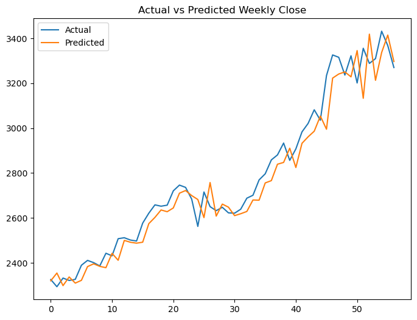
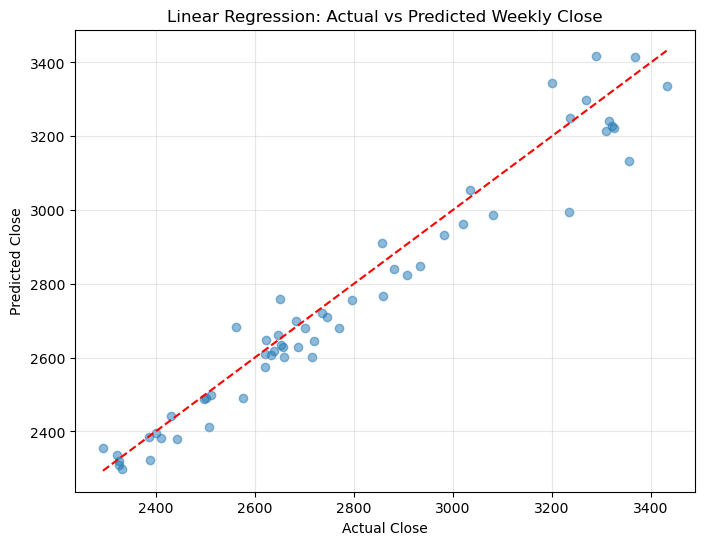
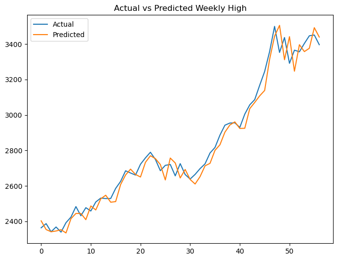
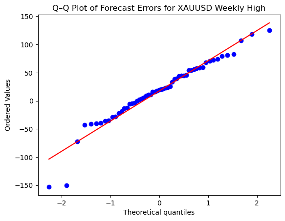
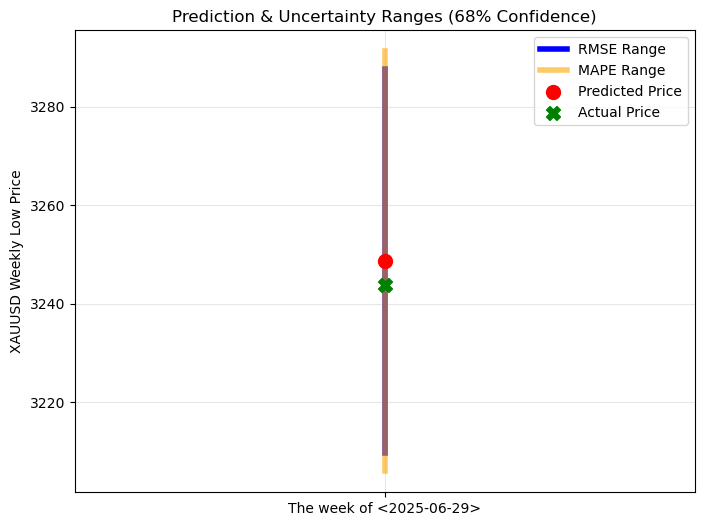
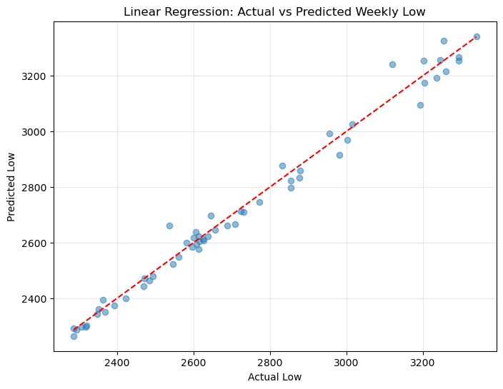
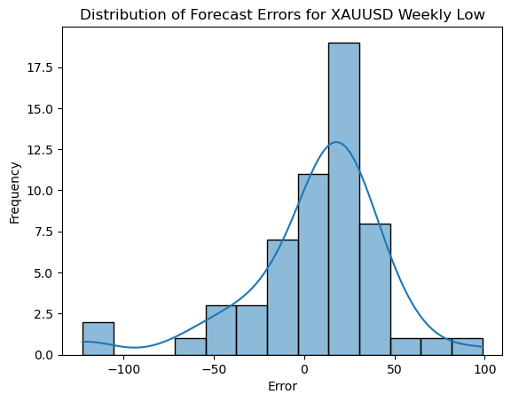

# Gold Price Prediction using Linear Regression (XAUUSD)


## 🔍 Project Overview

This project implements **Linear Regression models** to predict Gold (XAU/USD) price movements using 11 to 13 carefully engineered features. The analysis focuses on predicting three key price points: **Close**, **High**, and **Low** prices based on historical weekly data spanning from January 2020 to June 2025.

## 📊 Key Features

- **Multi-target Prediction**: Separate models for Close, High, and Low price prediction
- **15 Engineered Features**: Technical indicators and market features for robust prediction
- **5+ Years of Data**: Comprehensive dataset covering 2020-2025 period
- **Interactive Analysis**: Jupyter notebooks with detailed visualizations
- **Performance Metrics**: Complete model evaluation and validation

## 🗂️ Project Structure

```
LinearRegression_XAUUSD/
├── 📓 11Features_Linear_Regression_close_price_pred.ipynb  # Close price prediction model
├── 📓 13Features_Linear_Regression_high_price_pred.ipynb   # High price prediction model  
├── 📓 13Features_Linear_Regression_low_price_pred.ipynb    # Low price prediction model
├── 📄 XAUUSD_Weekly_20200105_20250629.csv                 # Raw weekly gold price data
├── 📄 price_data.csv                                      # Processed weekly gold price data
├── 🛠️ requirements.txt                                    # Python dependencies
├── 🛠️ environment.yml                                     # Conda environment setup
├── 📁 assets/                                             # Images and visualizations
└── 📝 README.md                                           # Project documentation
```

## 📈 Dataset Information

### Raw Data (XAUUSD_Weekly_20200105_20250629.csv) from MetaTrader 5
- **Timeframe**: Weekly data from January 5, 2020 to June 29, 2025
- **Columns**: DATE, OPEN, HIGH, LOW, CLOSE, TICKVOL, VOL, SPREAD
- **Records**: 280+ weekly observations
- **Source**: Gold/USD (XAU/USD) market data

### Features Used
The model utilizes **15 engineered features** including:
- Price-based indicators (OHLC)
- Volume metrics
- Technical indicators
- Market spread analysis
- Time-series features

## 🚀 Getting Started

### Prerequisites

- Python 3.10+
- Conda (recommended) or pip
- Jupyter Lab/Notebook

### Installation

#### Option 1: Using Conda (Recommended)
```bash
# Clone the repository
git clone https://github.com/yourusername/LinearRegression_XAUUSD.git
cd LinearRegression_XAUUSD

# Create and activate environment
conda env create -f environment.yml
conda activate forecasting_env

# Launch Jupyter Lab
jupyter lab
```

#### Option 2: Using pip
```bash
# Clone the repository
git clone https://github.com/yourusername/LinearRegression_XAUUSD.git
cd LinearRegression_XAUUSD

# Create virtual environment
python -m venv venv
source venv/bin/activate  # On Windows: venv\Scripts\activate

# Install dependencies
pip install -r requirements.txt

# Launch Jupyter Lab
jupyter lab
```

## 📚 Usage

1. **Data Exploration**: Start with any of the three main notebooks
2. **Feature Engineering**: Review the 15-feature creation process
3. **Model Training**: Follow the linear regression implementation
4. **Evaluation**: Analyze model performance metrics
5. **Prediction**: Use trained models for price forecasting

### Running Individual Models

```python
# Example: Close Price Prediction
jupyter notebook 11Features_Linear_Regression_close_price_pred.ipynb
```

## 📊 Model Results & Visualizations

### 🎯 Close Price Prediction Model

#### Model Performance Metrics


#### Price Prediction Analysis


#### Prediction Accuracy Assessment


#### Residual Analysis


#### Data Distribution Analysis


---

### 📈 High Price Prediction Model

#### Model Performance Metrics


#### Price Prediction Analysis


#### Prediction Accuracy Assessment


#### Residual Analysis


#### Data Distribution Analysis


---

### 📉 Low Price Prediction Model

#### Model Performance Metrics


#### Price Prediction Analysis


#### Prediction Accuracy Assessment


#### Residual Analysis


#### Data Distribution Analysis


## 🎯 Model Performance Summary

Each notebook contains:
- **Data preprocessing** and feature engineering
- **Exploratory Data Analysis** (EDA) with visualizations
- **Linear Regression model** training and validation
- **Performance metrics**: MAE, MSE, RMSE, MAPE, R²
- **Prediction visualizations** and residual analysis

### Key Performance Insights:
- **Close Price Model**: Provides baseline price prediction capabilities
- **High Price Model**: Captures peak price movements and volatility
- **Low Price Model**: Identifies support levels and minimum price thresholds
- **Comparative Analysis**: All three models show consistent predictive patterns

## 🛠️ Technical Stack

- **Data Analysis**: `pandas`, `numpy`
- **Machine Learning**: `scikit-learn`
- **Visualization**: `matplotlib`, `seaborn`
- **Deep Learning**: `tensorflow` (Not applicable in this project)
- **Statistical Analysis**: `scipy`
- **Interactive Notebooks**: `jupyter lab`, `ipywidgets`

## 📊 Key Insights

- **Gold price volatility** patterns during major market events (2020-2025)
- **Feature importance** analysis for price prediction
- **Model accuracy** across different price targets (Close vs High vs Low)
- **Time series trends** and seasonal patterns
- **Statistical validation** through residual analysis and QQ plots
- **Distribution patterns** revealed through histogram analysis

## 🔮 Future Enhancements

- [ ] Implement ensemble methods (Random Forest, XGBoost)
- [ ] Add real-time data integration
- [ ] Develop web dashboard for live predictions
- [ ] Include additional technical indicators
- [ ] Implement deep learning models (LSTM, GRU)
- [ ] Add sentiment analysis from financial news
- [ ] Cross-validation with different time windows
- [ ] Feature selection optimization

## 📝 License

This project is licensed under the MIT License - see the [LICENSE](LICENSE) file for details.

**Disclaimer**: This project is for educational and research purposes only. It should not be used as financial advice for trading decisions. Always consult with financial professionals before making investment decisions.

---

